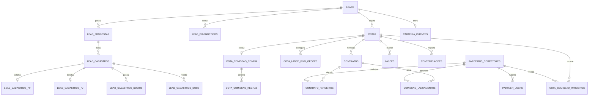

# Schema overview

## Premissas

Este overview foi montado com base em:

- migrations presentes em `migrations/`;
- colunas e joins usados nos `routers` e `services`.

Como o dump SQL completo do schema esta ausente no repositorio atual, alguns detalhes ficam como `pendente de confirmacao`.

## Visao por dominio

### 1. Leads

Tabela principal: `leads`

Campos observados no codigo:

- `id`
- `org_id`
- `nome`
- `telefone`
- `email`
- `origem`
- `owner_id`
- `etapa`
- `created_at`
- `updated_at`
- `first_contact_at`
- endereco principal:
  - `cep`
  - `logradouro`
  - `numero`
  - `complemento`
  - `bairro`
  - `cidade`
  - `estado`
  - `latitude`
  - `longitude`
  - `address_updated_at`

Relacionamentos usados:

- `lead_propostas.lead_id -> leads.id`
- `lead_cadastros.lead_id -> leads.id`
- `lead_diagnosticos.lead_id -> leads.id`
- `cotas.lead_id -> leads.id`
- `carteira_clientes.lead_id -> leads.id`
- `lead_interesses.lead_id -> leads.id` no kanban

Regras criticas:

- todo acesso interno filtra `org_id`;
- `telefone` ou `email` e obrigatorio na criacao;
- `etapa` participa do funil comercial e de automacoes de negocio.

### 2. Diagnosticos

Tabela principal: `lead_diagnosticos`

Campos observados:

- `id`
- `org_id`
- `lead_id`
- contexto:
  - `objetivo`
  - `prazo_meta_meses`
  - `preferencia_produto`
  - `regiao_preferencia`
- capacidade financeira:
  - `renda_mensal`
  - `reserva_inicial`
  - `comprometimento_max_pct`
  - `renda_provada`
- alvo:
  - `valor_carta_alvo`
  - `prazo_alvo_meses`
- estrategia:
  - `estrategia_lance`
  - `lance_base_pct`
  - `lance_max_pct`
  - `janela_preferida_semanas`
- scores calculados:
  - `score_risco`
  - `readiness_score`
  - `prob_conversao`
  - `prob_contemplacao_short`
  - `prob_contemplacao_med`
  - `prob_contemplacao_long`
- consentimento:
  - `consent_scope`
  - `consent_ts`
- `extras`
- `created_at`
- `updated_at`

Regra critica:

- o codigo assume 1 diagnostico vigente por `(org_id, lead_id)`, mas explicita que nao existe constraint unica conhecida no banco; o upsert e manual.

### 3. Propostas

Tabela principal: `lead_propostas`

Origem: `migrations/002_create_lead_propostas.sql`

Campos confirmados:

- `id`
- `org_id`
- `lead_id`
- `titulo`
- `campanha`
- `status`
- `public_hash` `UNIQUE`
- `payload` `jsonb`
- `pdf_url`
- `created_at`
- `created_by`
- `updated_at`

Campos usados no codigo mas ausentes da migration incremental:

- `ativo` `pendente de confirmacao` no schema atual

Dependencias:

- FK para `orgs(id)`
- FK para `leads(id)` com `ON DELETE CASCADE`
- `lead_cadastros.proposta_id -> lead_propostas.id`

Regras criticas:

- `public_hash` precisa ser unico;
- listagem interna normalmente filtra `ativo = true`;
- a proposta publica e resolvida apenas pelo hash, sem `org_id` no endpoint.

### 4. Cadastros de onboarding

Tabela principal: `lead_cadastros`

Origem: `migrations/003_lead_cadastros.sql`

Campos confirmados:

- `id`
- `org_id`
- `lead_id`
- `proposta_id`
- `tipo_cliente`
- `status`
- `token_publico` `UNIQUE`
- `created_source`
- `created_at`
- `updated_at`
- `expires_at`
- `first_ip`
- `first_user_agent`

Tabelas complementares:

- `lead_cadastros_pf`
- `lead_cadastros_pj`
- `lead_cadastros_socios`
- `lead_cadastros_docs`

Regras criticas:

- ha 1 cadastro principal por fluxo de proposta aceita, mas o banco nao mostra aqui uma unique key para `(org_id, lead_id, proposta_id)`; o backend tenta reutilizar o primeiro existente;
- `status` ganhou o valor `pendente_documentos` em migration posterior.

### 5. Cotas

Tabela principal: `cotas`

Campos observados no codigo:

- `id`
- `org_id`
- `lead_id`
- `administradora_id`
- `numero_cota`
- `grupo_codigo`
- `produto`
- `valor_carta`
- `valor_parcela`
- `prazo`
- `forma_pagamento`
- `indice_correcao`
- `fundo_reserva_percentual`
- `fundo_reserva_valor_mensal`
- `seguro_prestamista_ativo`
- `seguro_prestamista_percentual`
- `seguro_prestamista_valor_mensal`
- `taxa_admin_antecipada_ativo`
- `taxa_admin_antecipada_percentual`
- `taxa_admin_antecipada_forma_pagamento`
- `taxa_admin_antecipada_parcelas`
- `taxa_admin_antecipada_valor_total`
- `taxa_admin_antecipada_valor_parcela`
- `parcela_reduzida`
- `fgts_permitido`
- `embutido_permitido`
- `embutido_max_percent` `pendente de confirmacao no schema`
- `autorizacao_gestao`
- `data_adesao`
- `assembleia_dia`
- `furo_meses`
- `tipo_lance_preferencial`
- `estrategia`
- `objetivo`
- `status`
- `observacoes`
- `created_at`

Dependencias:

- `cotas.lead_id -> leads.id`
- `contratos.cota_id -> cotas.id`
- `cota_lance_fixo_opcoes.cota_id -> cotas.id`
- `cota_comissao_config.cota_id -> cotas.id`
- `cota_comissao_parceiros.cota_id -> cotas.id`
- `lances.cota_id -> cotas.id`
- `contemplacoes.cota_id -> cotas.id`

Regras criticas:

- cota representa a carta/posicao operacional, separada do contrato;
- varias regras financeiras e de assembleia partem da cota;
- status relevantes vistos no codigo: `ativa`, `contemplada`, `cancelada`.

### 6. Contratos

Tabela principal: `contratos`

Campos observados:

- `id`
- `org_id`
- `deal_id`
- `cota_id`
- `numero`
- `status`
- `data_assinatura`
- `data_pagamento`
- `data_alocacao`
- `data_contemplacao`
- documento PDF:
  - `pdf_path`
  - `pdf_filename`
  - `pdf_mime_type`
  - `pdf_size_bytes`
  - `pdf_uploaded_at`
  - `pdf_uploaded_by`
  - `pdf_uploaded_actor_type`
  - `pdf_version`
  - `pdf_status`
- `created_at`

Dependencias:

- `contratos.cota_id -> cotas.id`
- `contrato_parceiros.contrato_id -> contratos.id`
- `comissao_lancamentos.contrato_id -> contratos.id`

Regras criticas:

- status validos no backend:
  - `pendente_assinatura`
  - `pendente_pagamento`
  - `alocado`
  - `contemplado`
  - `cancelado`
- o backend valida transicoes permitidas e correcoes retroativas;
- mudanca de status pode mover automaticamente a etapa do lead.

### 7. Comissoes

Tabelas principais:

- `cota_comissao_config`
- `cota_comissao_regras`
- `cota_comissao_parceiros`
- `comissao_lancamentos`

Campos principais observados:

`cota_comissao_config`

- `id`
- `org_id`
- `cota_id`
- `percentual_total`
- `base_calculo`
- `modo`
- `imposto_padrao_pct`
- `primeira_competencia_regra`
- `furo_meses_override`
- `ativo`
- `observacoes`
- `created_at`
- `updated_at`

`cota_comissao_regras`

- `id`
- `org_id`
- `cota_comissao_config_id`
- `ordem`
- `tipo_evento`
- `offset_meses`
- `percentual_comissao`
- `descricao`

`cota_comissao_parceiros`

- `id` `pendente de confirmacao`
- `org_id`
- `cota_id`
- `parceiro_id`
- `percentual_parceiro`
- `imposto_retido_pct`
- `ativo`
- `observacoes`
- `created_at`
- `updated_at`

`comissao_lancamentos`

- `id`
- `org_id`
- `contrato_id`
- `cota_id`
- `cota_comissao_config_id`
- `regra_id`
- `parceiro_id`
- `beneficiario_tipo`
- `tipo_evento`
- `ordem`
- `competencia_prevista`
- `competencia_real`
- `percentual_base`
- `valor_base`
- `valor_bruto`
- `imposto_pct`
- `valor_imposto`
- `valor_liquido`
- `status`
- `liberado_por_evento_em`
- `pago_em`
- `repasse_status`
- `repasse_previsto_em`
- `repasse_pago_em`
- `repasse_observacoes`
- `observacoes`
- `created_at`
- `updated_at`

Regras criticas:

- soma das regras precisa fechar o `percentual_total`;
- soma dos parceiros nao pode superar a comissao total;
- exclusao e bloqueada quando ja existem lancamentos pagos ou repasses pagos;
- sincronizacao de parceiro/contrato depende da configuracao da cota.

### 8. Parceiros

Tabelas principais:

- `parceiros_corretores`
- `partner_users`
- `contrato_parceiros`

`parceiros_corretores`

Campos observados:

- `id`
- `org_id`
- `nome`
- `cpf_cnpj`
- `telefone`
- `email`
- `pix_tipo`
- `pix_chave`
- `ativo`
- `observacoes`
- `created_at`
- `updated_at`

`partner_users`

Campos observados:

- `id`
- `org_id`
- `parceiro_id`
- `auth_user_id`
- `email`
- `nome`
- `telefone`
- `ativo`
- `can_view_client_data`
- `can_view_contracts`
- `can_view_commissions`
- `invited_at`
- `invite_sent_at`
- `access_enabled_at`
- `disabled_at`
- `disabled_reason`
- `last_login_at`
- `created_at`
- `updated_at`

`contrato_parceiros`

Campos observados:

- `id`
- `org_id`
- `contrato_id`
- `parceiro_id`
- `origem`
- `principal`
- `observacoes`
- `created_at`
- `updated_at`

Regras criticas:

- um parceiro nao pode ser excluido se ainda tiver:
  - acesso em `partner_users`
  - vinculos em cotas/comissoes/contratos
- o portal usa `partner_users` como fonte de permissao, nao apenas o cadastro operacional.

### 9. Carteira

Tabela principal: `carteira_clientes`

Campos observados:

- `id`
- `org_id`
- `lead_id`
- `status`
- `origem_entrada`
- `entered_at`
- `observacoes`

Regra critica:

- o backend impede duplicidade funcional por `(org_id, lead_id)` ao usar `ensure_carteira_cliente`.

### 10. Lances e contemplacao

Tabelas observadas:

- `lances`
- `contemplacoes`
- `cota_lance_fixo_opcoes`
- `lead_interesses`
- regra operacional por administradora `pendente de confirmacao do nome fisico da tabela`, mas o codigo consulta configuracao de operadora

Regras criticas:

- lances sao registrados por `cota_id` e competencia;
- contemplacao afeta status da cota e eventos de comissao;
- opcoes de lance fixo nao podem repetir ordem nem percentual.

## Relacionamentos principais

## Unicidade e integridade observadas

- `lead_propostas.public_hash` e unico.
- `lead_cadastros.token_publico` e unico.
- `lead_cadastros_pf.cadastro_id` e PK/FK 1:1.
- `lead_cadastros_pj.cadastro_id` e PK/FK 1:1.
- `lead_cadastros_socios` depende de `cadastro_id`.
- `carteira_clientes` nao mostra unique key no schema aqui, mas o backend trata como relacao unica por lead.
- `partner_users` e tratado no codigo como uma linha por parceiro por organizacao.
- `lead_diagnosticos` e tratado como uma linha vigente por lead/org, sem constraint unica confirmada.

## Dependencias de negocio

- sem `data_adesao`, a projecao de comissao da cota falha;
- sem `cota_id`, contrato nao existe no modelo atual;
- sem `parceiro_id`, nao ha repasse de comissao;
- sem `pdf_path`, o download assinado de contrato nao pode ser gerado;
- sem `org_id`, endpoints internos principais falham logo na entrada.
